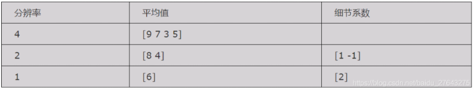

**参考链接：**

 [哈尔小波变换的原理及其实现(Haar) (360doc.com)](http://www.360doc.com/content/13/0925/12/10724725_316957631.shtml) 

csdn博客：Python 离散小波变换（DWT） pywt库

**基础概念：**

 **变换**：不管是压缩、滤波还是图像处理，本质都是变换，就是基。例如傅里叶变换就是将信号用该空间的基的线性组合进行表示 • 

**正交：** 如果两个向量的内积为0，它们就是正交的；如果一个向量序列相互对偶正交，并且长度为1，它们就是正交归一化的。 

哈尔小波变换是，小波变换中最简单的一种变换，也是最早提出的小波变换。

## 一维哈尔小波变换

| 例：求只有4个像素[9 7 3 5]的图像的小波变换系数。 计算步骤如下： |
| ------------------------------------------------------------ |
| 1、**求均值**(averaging)。计算相邻像素对的平均值，得到一幅分辨率比较低的新图像，新的图像的分辨率是原来的1/2，相应的像素值为：[8 4] |
| 2、**求差值**(differencing)。上面的均值存储了图像的整体信息，但很多细节被丢掉了。所以要记录图像的细节信息，这样在重构时能够恢复图像的全部信息。方法是使用这个像素对的差值除以2，结果为[8 4 1 -1] 以上两步形成第一次分解的结果[8 4 1 -1]，包含了图像的整体信息和细节信息。 |
| 接下来重复1、2步，将整体信息再次分解，得到二级分解结果[6,2,1,-1] |

从这个例子中我们可以看到：
① 对这个给定的变换，我们可以从所记录的数据中重构出各种分辨率的图像。例如，在分辨率为1的图像基础上重构出分辨率为2的图像，在分辨率为2的图像基础上重构出分辨率为4的图像。
②变换过程中没有丢失信息，因为能够从所记录的数据中重构出原始图像。
③ 通过变换之后产生的细节系数的幅度值比较小，这就为图像压缩提供了一种途径，例如去掉一些微不足道的细节系数并不影响对重构图像的理解。

这个过程就叫做哈尔小波变换，也称哈尔小波分解，这个概念可以推广到使用其他小波基的变换。

## 二维哈尔小波变换

​        对于二维小波变换，通常一次分解形成了整体图像，水平细节，垂直细节，对角细节。首先我们按照一维小波分解的原理，按照行顺序对行进行处理，然后按照列顺序对行处理结果进行同样的处理。

 经过小波变换后图像会生成低频信息和高频信息。低频信息对应于求均值，高频信息对应于求差值。
`均值是局部的平均值，变化缓慢，属于低频信息，存储图片的轮廓信息，近似信息`
`差值是局部的波动值，变化较快，属于高频信息，存储图片的细节信息，局部信息，另外含有噪音` 

假设有一幅灰度图像，其中的一个图像块用矩阵A 表示：

​       一个图像块是一个二维矩阵，进行小波变换时可以对矩阵的每一行进行变换，然后对行变换后的每一列进行变换，最后对经过变换之后的图像矩阵进行编码。

第一步：在第一行上取每一对像素的平均值，并将结果放到第一行的前四个位置，其余4个数是第一行每一对像素的第一个数和对应的平均值之差（也可以是 这个像素对的差值除以2 ，计算结果是一样的。）将结果放到第一行的最后四个位置。

第二步：对第一行的前四个数使用与第一步相同的方法，得到两个平均值和两个差（系数），并依次放在第一行的前四个位置，其余四个细节系数位置不动。

第三步：用与第一步和第二步相同的方法，对剩下的一对平均值求均值和差值。

用求均值和差值的方法，对矩阵每一行进行计算，得到矩阵A‘。

每行的第一个元素是该行像素值的平均值，其余是这行的细节系数。用同样的方法，对A’的每一列进行计算，得到A''

左上角的元素是整个图像块的像素值的平均值，其余是该图像块的细节系数，根据这个事实，如果从矩阵中去掉图像的某些细节系数，事实证明重构的图像质量仍然可以接受。

具体做法是设置一个阈值D，应该是像素值小于等于5的细节系数就把它当做0看待。这样变换后的矩阵为A‘’‘

’0‘的数目增加了18个，也就是去掉了18个细节系数，这样可以提高编码的效率。

### 上面解释的图示：

（来自csdn博客：）

 **经过小波变换后图像会生成低频信息和高频信息。**低频信息对应于求均值，高频信息对应于求差值。
`均值是局部的平均值，变化缓慢，属于低频信息，存储图片的轮廓信息，近似信息`
`差值是局部的波动值，变化较快，属于高频信息，存储图片的细节信息，局部信息，另外含有噪音` 

 水平和竖直两个方向进行低通和高通滤波（水平和竖直先后不影响），用图像表述如下图所示： 

其中：

- b: 原图信息
- h1 :水平方向的细节（高频信息），
- v1 表示竖直方向的细节（高频信息），
- c1表示对角线方向的细节（高频信息）

