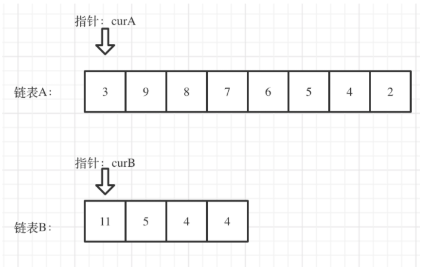
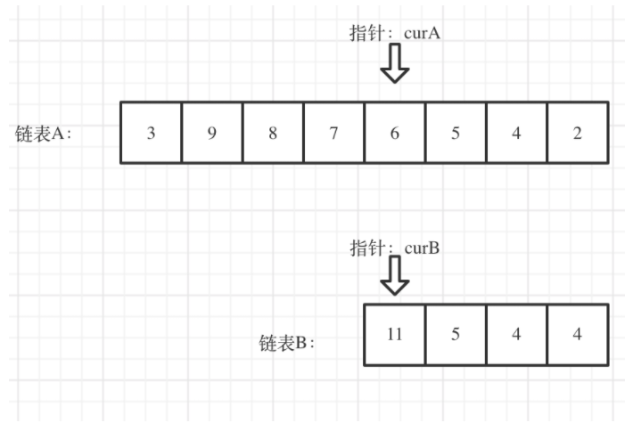
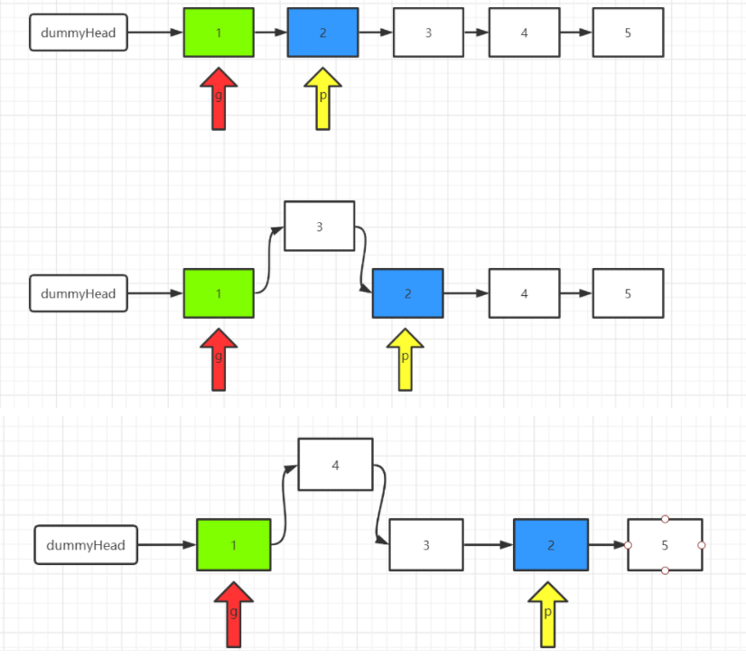

---

layout:     post
title:      「算法刷题」链表相关经典题目
subtitle:   基于C++语言
date:       2021-10-25
author:     WJ
header-img: img/post-bg-hacker.png
catalog: false
tags:
    - 算法刷题
---

# 一、

顺序结构：这里主要指的是数组或字符串。

# 一、链表的基本操作

| **LeetCode题目** | **相关题目类型**     | **相关链接**                                         |
| ---------------- | -------------------- | ---------------------------------------------------- |
| 707              | 设计链表（中等难度） | https://leetcode-cn.com/problems/design-linked-list/ |

## 在链表中添加或删除元素时，记得修改链表长度；

代码：csdn博客：力扣 707. 设计链表 链表

```c++
class MyLinkedList {
public:
    /** 初始化数据结构 */
    MyLinkedList():head(new node()),tail(head),size(0) {}
    
    /** 得到链表中第index个结点的值，index小于0或大于链表长度（链表的index从0开始），返回-1 */
    int get(int index) {
        if(index>=size||index<0)
            return -1;
        else if(index==size-1)
            return tail->val;
        
        node *cur=head->next;
        while(index--)
            cur=cur->next;
        return cur->val;
    }
    
    /** 添加新的头节点 */
    void addAtHead(int val) {
        ++size;
        node *tmp=new node(val);
        tmp->next=head->next;
        head->next=tmp;
        //注意更新尾节点
        if(size==1)
            tail=tmp;
    }
    
    /** 在链表最后添加一个结点. */
    void addAtTail(int val) {
        ++size;
        node *tmp=new node(val);
        tail->next=tmp;
        tail=tmp;
    }
    
    /** 在链表第index个结点前添加结点，
    如果index等于链表长度，则将结点添加到链表末尾。
    如果index大于链表长度，则不会插入结点
    如果index小于0，则在头部插入结点。
     */
    void addAtIndex(int index, int val) {
        if(index<=0)
            addAtHead(val);
        else if(index==size)
            addAtTail(val);
        else if(index<size){
            node *cur=head;
            while(index--)
                cur=cur->next;
            // node *nxt=cur->next;
            // node *tmp=new node(val);
            // cur->next=tmp;
            // tmp->next=nxt;
            node *tmp=new node(val);
            // cur指向第index个结点的前一个
            tmp->next=cur->next;
            cur->next=tmp;
            ++size;
        }
    }
    
    /** 索引有效，则删除链表的第index个结点*/
    void deleteAtIndex(int index) {
        if(index>=size||index<0)
            return ;
        node *cur=head;
        while(index--)
            cur=cur->next;
        node *tmp=cur->next;
        cur->next=tmp->next;
        //tmp指向最后一个结点时，注意更新尾节点，
        if(!tmp->next)
            tail=cur;// cur指向第index个的前一个结点
        delete(tmp);
        --size;
    }
private:
    struct node{
        int val;
        node *next;
        node():val(0),next(nullptr){}
        node(int v):val(v),next(nullptr){}
    };
    node *head=nullptr;
    node *tail=nullptr;
    int size=0;
};

/**
 * Your MyLinkedList object will be instantiated and called as such:
 * MyLinkedList* obj = new MyLinkedList();
 * int param_1 = obj->get(index);
 * obj->addAtHead(val);
 * obj->addAtTail(val);
 * obj->addAtIndex(index,val);
 * obj->deleteAtIndex(index);
 */

```


# 二、链表的相交

| **LeetCode题目** | **相关题目类型**     | 关键点                                                       | **相关链接**                                                 |
| ---------------- | -------------------- | ------------------------------------------------------------ | ------------------------------------------------------------ |
| 面试题02.07.     | 链表相交（简单难度） | 长链表的遍历节点先多走和短链表的长度差个节点，然后同时遍历两个节点比较是否存在相同节点 | https://leetcode-cn.com/problems/intersection-of-two-linked-lists-lcci/ |

链接：https://leetcode-cn.com/problems/intersection-of-two-linked-lists-lcci/solution/dai-ma-sui-xiang-lu-dai-ni-gao-ding-lian-5ykc/
来源：力扣（LeetCode）

交点不是数值相等，而是指针相等。

 看如下两个链表，目前curA指向链表A的头结点，curB指向链表B的头结点： 




 我们求出两个链表的长度，并求出两个链表长度的差值，然后让curA移动到，和curB 末尾对齐的位置，如图： 




此时我们就可以比较curA和curB是否相同，如果不相同，同时向后移动curA和curB，如果遇到curA == curB，则找到焦点。

否则循环退出返回空指针。

作者：carlsun-2
链接：https://leetcode-cn.com/problems/intersection-of-two-linked-lists-lcci/solution/dai-ma-sui-xiang-lu-dai-ni-gao-ding-lian-5ykc/
来源：力扣（LeetCode）

```c++
/**
 * Definition for singly-linked list.
 * struct ListNode {
 *     int val;
 *     ListNode *next;
 *     ListNode(int x) : val(x), next(NULL) {}
 * };
 */
class Solution {
public:
    ListNode *getIntersectionNode(ListNode *headA, ListNode *headB) {
        ListNode *curA=headA;
        ListNode *curB=headB;
        int lenA=0;
        int lenB=0;
        //计算A长度
        while(curA){
            lenA++;
            curA=curA->next;
        }
        //计算B长度
        while(curB){
            lenB++;
            curB=curB->next;
        }
        curA=headA;
        curB=headB;
        // 让curA指向长的链表,lenA为其长度。
        if(lenB>lenA){
            swap(lenA,lenB);
            swap(curA,curB);
        }
        // 计算两个链表的长度差；
        int gap=lenA-lenB;
        // curA指向链表的一个结点，使两个链表的末尾对齐
        while(gap--){
            curA=curA->next;
        }
        // 同时遍历，相等则返回结点
        while(curA){
            if(curA==curB){
                return curA;
            }
            curA=curA->next;
            curB=curB->next;
        }
        //不等，返回空。
        return NULL;
    }
};


```

# 

| **LeetCode题目** | **相关题目类型**      | 关键点                                                       | **相关链接**                                                 |
| ---------------- | --------------------- | ------------------------------------------------------------ | ------------------------------------------------------------ |
| 92               | 反转链表2（中等难度） | 长链表的遍历节点先多走和短链表的长度差个节点，然后同时遍历两个节点比较是否存在相同节点 | [92. 反转链表 II - 力扣（LeetCode） (leetcode-cn.com)](https://leetcode-cn.com/problems/reverse-linked-list-ii/) |

解题思路：
1、我们定义两个指针，分别称之为 g(guard 守卫) 和 p(point)。
我们首先根据方法的参数 m 确定 g 和 p 的位置。将 g 移动到第一个要反转的节点的前面，将 p 移动到第一个要反转的节点的位置上。我们以 m=2，n=4为例。
2、将 p 后面的元素删除，然后添加到 g 的后面。也即头插法。
3、根据 m 和 n 重复步骤（2）
4、返回 dummyHead.next
链接：https://leetcode-cn.com/problems/reverse-linked-list-ii/solution/java-shuang-zhi-zhen-tou-cha-fa-by-mu-yi-cheng-zho/





```c++
class Solution {
    public ListNode reverseBetween(ListNode head, int m, int n) {
        // 定义一个虚拟头结点， 方便处理
        ListNode dummyHead = new ListNode(0);
        dummyHead.next = head;

        // 初始化指针
        ListNode g = dummyHead;
        ListNode p = dummyHead.next;

        // 将指针移到相应的位置
        for(int step = 0; step < m - 1; step++) {
            g = g.next; p = p.next;
        }

        // 头插法插入节点
        for (int i = 0; i < n - m; i++) {
            ListNode removed = p.next;
            p.next = p.next.next;

            removed.next = g.next;
            g.next = removed;
        }

        return dummyHead.next;
    }
}
```


| **LeetCode题目** | **相关题目类型**      | 关键点 | **相关链接**                                                 |
| ---------------- | --------------------- | ------ | ------------------------------------------------------------ |
| 142              | 环形链表2（中等难度） |        | [142. 环形链表 II - 力扣（LeetCode） (leetcode-cn.com)](https://leetcode-cn.com/problems/linked-list-cycle-ii/) |

## 思路

主要考察两知识点：

* 判断链表是否环

* 如果有环，如何找到这个环的入口

* ### 判断链表是否有环

  可以使用快慢指针法，  分别定义 fast 和 slow指针，从头结点出发，fast指针每次移动两个节点，slow指针每次移动一个节点，如果 fast 和 slow指针在途中相遇 ，说明这个链表有环。

  为什么fast 走两个节点，slow走一个节点，有环的话，一定会在环内相遇呢，而不是永远的错开呢

首先第一点： **fast指针一定先进入环中，如果fast 指针和slow指针相遇的话，一定是在环中相遇，这是毋庸置疑的。**

那么来看一下，**为什么fast指针和slow指针一定会相遇呢？**

可以画一个环，然后让 fast指针在任意一个节点开始追赶slow指针。

会发现最终都是这种情况， 如下图：


ast和slow各自再走一步， fast和slow就相遇了

这是因为fast是走两步，slow是走一步，**其实相对于slow来说，fast是一个节点一个节点的靠近slow的**，所以fast一定可以和slow重合。

### 如果有环，如何找到这个环的入口

**此时已经可以判断链表是否有环了，那么接下来要找这个环的入口了。**

假设从头结点到环形入口节点 的节点数为x。
环形入口节点到 fast指针与slow指针相遇节点 节点数为y。
从相遇节点  再到环形入口节点节点数为 z。 如图所示：


那么相遇时：
slow指针走过的节点数为: `x + y`，
fast指针走过的节点数：` x + y + n (y + z)`，n为fast指针在环内走了n圈才遇到slow指针， （y+z）为 一圈内节点的个数A。

因为fast指针是一步走两个节点，slow指针一步走一个节点， 所以 fast指针走过的节点数 = slow指针走过的节点数 * 2：

`(x + y) * 2 = x + y + n (y + z)`

两边消掉一个（x+y）: `x + y  = n (y + z) `

因为要找环形的入口，那么要求的是x，因为x表示 头结点到 环形入口节点的的距离。

以要求x ，将x单独放在左面：`x = n (y + z) - y` ,

再从n(y+z)中提出一个 （y+z）来，整理公式之后为如下公式：`x = (n - 1) (y + z) + z  ` 注意这里n一定是大于等于1的，因为 fast指针至少要多走一圈才能相遇slow指针。

这个公式说明什么呢？

先拿n为1的情况来举例，意味着fast指针在环形里转了一圈之后，就遇到了 slow指针了。

当 n为1的时候，公式就化解为 `x = z`，

这就意味着，**从头结点出发一个指针，从相遇节点 也出发一个指针，这两个指针每次只走一个节点， 那么当这两个指针相遇的时候就是 环形入口的节点**。

也就是在相遇节点处，定义一个指针index1，在头结点处定一个指针index2。

让index1和index2同时移动，每次移动一个节点， 那么他们相遇的地方就是 环形入口的节点。


那么 n如果大于1是什么情况呢，就是fast指针在环形转n圈之后才遇到 slow指针。

其实这种情况和n为1的时候 效果是一样的，一样可以通过这个方法找到 环形的入口节点，只不过，index1 指针在环里 多转了(n-1)圈，然后再遇到index2，相遇点依然是环形的入口节点。

```
/**
 * Definition for singly-linked list.
 * struct ListNode {
 *     int val;
 *     ListNode *next;
 *     ListNode(int x) : val(x), next(NULL) {}
 * };
 */
class Solution {
public:
    ListNode *detectCycle(ListNode *head) {
        ListNode* fast = head;
        ListNode* slow = head;
        while(fast != NULL && fast->next != NULL) {
            slow = slow->next;
            fast = fast->next->next;
            // 快慢指针相遇，此时从head 和 相遇点，同时查找直至相遇
            if (slow == fast) {
                ListNode* index1 = fast;
                ListNode* index2 = head;
                while (index1 != index2) {
                    index1 = index1->next;
                    index2 = index2->next;
                }
                return index2; // 返回环的入口
            }
        }
        return NULL;
    }
};
```

