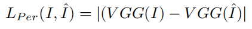

---

layout:     post
title:      「科研笔记」S3net的损失函数
subtitle:   基于pytorch
date:       2021-11-02
author:     WJ
header-img: img/post-bg-hacker.png
catalog: false
tags:
    - 算法刷题
---

# 感知损失

项目DRN和S3Net都是用的 J. Johnson, A. Alahi, and L. Fei-Fei,  2016《Perceptual losses for real-time style transfer and super-resolution,” in European conference on computer vision》的感知函数

   感知损失利用从预训练的深度神经网络（例如 VGG19 ）中获得的多尺度特征来测量真实图像和网络预测图像之间的视觉特征差异。 在DRN、S3Net中使用 ImageNet训练集 上预训练的 VGG19 网络来计算感知损失。  

​      感知损失（使用VGG）公式为：





## Vgg19网络结构：

VGG19包含了19个隐藏层（16个卷积层和3个全连接层）。


## DRN代码中，使用Pytorch获取Vgg19网络：

```c++
import torch
import torchvision.models as models
# 加载预训练的模型
vgg_model = models.vgg19(pretrained=True)
# 获取中间层特征
vgg_pretrained_features = vgg_model.features
print('model.features[0]', model.features[0]) #Conv2d(3, 64, kernel_size=(3, 3), stride=(1, 1), padding=(1, 1))
```

```
from torchvision import models

class Vgg19(torch.nn.Module):
    def __init__(self, requires_grad=False):
        super(Vgg19, self).__init__()
        # 加载预训练的模型
        # vgg_pretrained_features = models.vgg19(pretrained=True).features
        
        # 加载预训练模型
        model = models.vgg19(pretrained=True)
        # 获取中间层特征
        vgg_pretrained_features = model.features
        
        self.slice1 = torch.nn.Sequential()
        self.slice2 = torch.nn.Sequential()
        self.slice3 = torch.nn.Sequential()
        self.slice4 = torch.nn.Sequential()
        self.slice5 = torch.nn.Sequential()
        # 把不同层的特征分别加入不同的模块
        for x in range(2):
            self.slice1.add_module(str(x), vgg_pretrained_features[x])
        for x in range(2, 7):
            self.slice2.add_module(str(x), vgg_pretrained_features[x])
        for x in range(7, 12):
            self.slice3.add_module(str(x), vgg_pretrained_features[x])
        for x in range(12, 21):
            self.slice4.add_module(str(x), vgg_pretrained_features[x])
        for x in range(21, 28):
            self.slice5.add_module(str(x), vgg_pretrained_features[x])
        # 设置所有参数都不需要计算梯度
        if not requires_grad:
            for param in self.parameters():
                param.requires_grad = False

    def forward(self, X):
        # 获取不同模块的特征
        h_relu1 = self.slice1(X)
        h_relu2 = self.slice2(h_relu1)
        h_relu3 = self.slice3(h_relu2)
        #h_relu4 = self.slice4(h_relu3)
        #h_relu5 = self.slice5(h_relu4)
        #out = [h_relu1, h_relu2, h_relu3, h_relu4, h_relu5]
        out = [h_relu1, h_relu2, h_relu3]#, h_relu4, h_relu5]
        return out
```

## 用vgg计算感知损失（VGGLoss）

VGG19本是用来进行分类的，进行可视化和用作VGG loss 自然也就是用到全连接层之前的内容

```
class VGGLoss(nn.Module):
    def __init__(self, gpu_ids):
        super(VGGLoss, self).__init__()
        self.vgg = Vgg19().cuda()
        self.criterion = nn.L1Loss()
        self.weights = [1.0 / 32, 1.0 / 16, 1.0 / 8, 1.0 / 4, 1.0]

    def forward(self, x, y):
        x_vgg, y_vgg = self.vgg(x), self.vgg(y)
        loss = 0
        for i in range(len(x_vgg)):
            loss += self.weights[i] * self.criterion(x_vgg[i], y_vgg[i].detach())
        return loss
```

#  Charbonnier loss 

Charbonnier 损失 （ A general and adaptive robust loss function ），可以看作是鲁棒的 L1 损失函数。

  其中 I 和 I^ 分别代表真实图像和来自提出网络的 relit 图像，并且 e 被视为一个微小的常数（例如 10−6 ）以实现稳定和鲁棒的收敛。 LC ha 可以还原全局结构并且可以更鲁棒地处理异常值。


```python
'''''''''
@文件名: ChaLoss.py
@作者: XW
@时间: 2021/11/2 23:05
@环境: Python,Numpy
@描述: 无
@参考: 无
'''''''''
import torch
import numpy as np

#定义L1损失函数
def cha_loss(y_true,y_pre):

    e = 10**(-6)
    loss=torch.mean(torch.sqrt((y_true-y_pre)**2)+e**2)
    # loss = torch.sqrt((y_true-y_pre)**2)
    # loss = np.mean(np.sqrt((y_true - y_pre) ** 2) )
    return loss

if __name__=='__main__':
    y_true=torch.tensor([1.0,2.0,3.0])
    y_pre=torch.tensor([4.0,5.0,6.0])
    res=cha_loss(y_true,y_pre)
    print(type(res))
```

