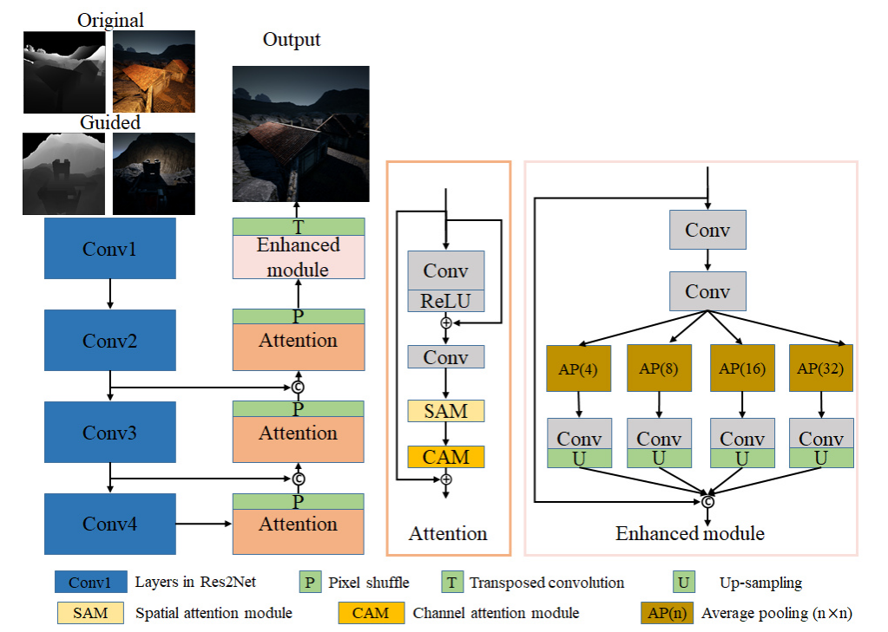

---

layout:     post
title:      「项目复现」S3net的网络结构实现
subtitle:   CVPRW 2021
date:       2021-11-16
author:     WJ
header-img: img/post-bg-hacker.png
catalog: true
tags:
    - 项目复现
---

​		本博客是作者复现《S3Net: A Single Stream Structure for Depth Guided Image Relighting》的网络结构时的学习笔记。

## 1、网络模型

​			该文的整个网络模型的输入是原始RGB图（1024x1024x3）、原始深度图（1024x1024x1）、引导RGB图（1024x1024x3）和引导深度图（1024x1024x1）连接在一起形成的8通道张量（1024x1024x8），输出的是3通道的预测RGB图（1024x1024x3）。

​			本文提出的 S3Net 的架构如下图所示。该网络基于***《Knowledge transfer dehazing network for nonhomogeneous dehazing》***，包含编码器和解码器部分。 

​		【编码器】该文使用***《Res2net: A new multi-scale backbone architecture》***提出的Res2Net101网络主干作为编码器，因为Res2Net 可以在粒度级别表示多尺度特征，并增加每个网络层的感受野范围，输入通过主干后可以实现多尺度特征提取。该文的工作在Res2Net做了如下修改：

- 修改第一个卷积使网络可以使用8 通道张量作为输入；
- 丢弃网络最后的全连接层，使最终输出的特征图的大小为 16分之一 ；
- 编码器的初始权重是用 ImageNet 训练的预训练参数，底部特征使用跳跃连接连接到解码器。

​       【解码器】解码器由卷积堆栈组成，以细化特征图。

​		 利用注意力模块（Attention，P）来细化中间特征。 注意模块由残差层 （residual layer）***《Deep residual learning for image recognition》***、空间注意力模块（SAM）***《Recurrent models of visual attention》*** 和通道注意力模块（CAM）***《Squeeze-and-excitation networks》*** 组成。

​		 利用像素混洗（Pixel shuffle，P）***《Real-time single image and video super-resolution using an efficient subpixel convolutional neural network》***和转置卷积（Transposed convolution，T）***《Pixel transposed convolutional networks》***来放大特征图。

​		此外，受***《Enhanced pix2pix dehazing network》***的启发，该文章在 S3Net 中添加了增强模块。 增强模块利用不同步幅的平均池化来改变特征图和感受野的大小，这对于提取多尺度特征是有效的。 最后，应用上采样来恢复减少的特征图，并将所有特征图拼接起来。 

​		【跳跃连接】众所周知，类 U-Net 结构在许多任务中是有益的，例如图像去雾（《PMS-net: Robust haze removal based on patch map for single images》，《PMHLD: patch map-based hybrid learning dehazenet for single image haze removal》） 和语义分割 （***《U-net: Convolutional networks for biomedical image segmentation》***）。 它的跳跃连接鼓励特征重用。 因此S3Net 中也采用跳跃连接将来自主干的最后三个特征图合并到它们对应的特征图。

