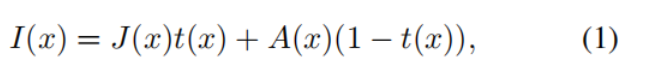
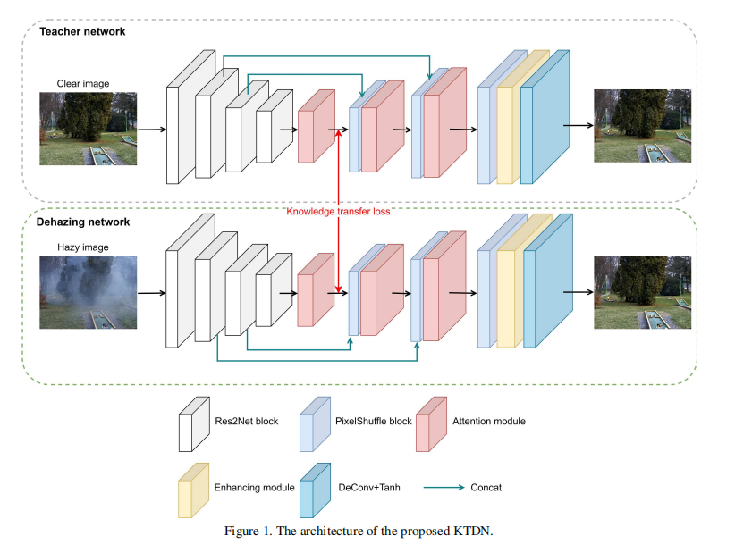
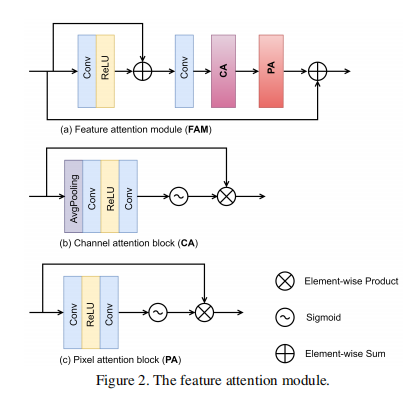
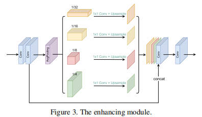
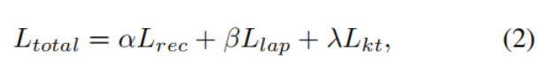
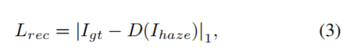
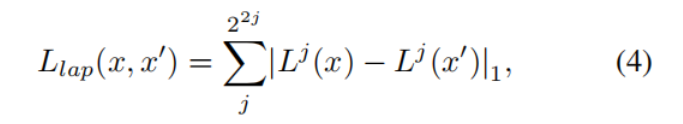
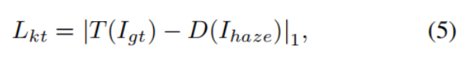

---

layout:     post
title:      「论文分享」对于非均匀去模糊的知识迁移去模糊网络
subtitle:   CVPRW 2020
date:       2021-11-21
author:     WJ
header-img: img/post-bg-hacker.png
catalog: true
tags:
    - 论文分享
---

​		本博客是论文《Knowledge Transfer Dehazing Network for NonHomogeneous Dehazing》的中文翻译。

# 摘要

​        单幅图像去模糊是最近引起重要关注的问题。 这是一项具有挑战性的图像处理任务，尤其是在非均匀场景中。然而，由于现实世界的模糊（haze）分布未知，现有的去模糊方法通常用于处理在实践中容易违反（violated）的均匀模糊。 在本文中，我们提出了一种知识迁移方法，该方法利用大量的清晰图像来训练教师网络，以提供强大而稳健的图像先验。派生的架构被称为知识转换去模糊网络（KTDN），它由具有相同架构的教师网络和去模糊网络组成。 通过中间特征之间的监督，鼓励去模糊网络模仿教师网络。 此外，我们使用注意力机制将通道注意力与像素注意力相结合以捕获有效信息，并采用增强模块来细化细节纹理。 在合成和真实场景数据集上的大量实验结果表明，所提出的方法在定量和定性评估方面均优于最先进的方法。  KTDN 在 NTIRE-2020 NonHomogeneous Dehazing Challenge [4, 5] 中排名第二。

# 1、简介

​        单幅图像去模糊是近年来备受关注的一个问题。在通常以颜色和纹理失真为特征的朦胧场景中，数字图像将会退化。
​       为了解决这一问题，提高模糊图像的可见性，已经提出了许多去模糊方法[12.2010《Single image haze removal using dark channel prior》,

9. 2016.《Dehazenet: An end-to-end system for single image haze removal》

,14. 2017.《Aod-net: All-in-one dehazing network》

,22. 2018. 《Densely connected pyramid dehazing network》

,10 .2019.《 Gated  context aggregation network for image dehazing and deraining》

,19.  2019. 《Enhanced pix2pix dehazing network》

]。一些成功的去模糊方法是基于物理散射模型[17. 1957.《Vision through the atmosphere》]，用公式表示为：

​        其中I为输入的模糊图像，J为恢复后的图像，t和A分别为透射图和全球大气光。然而，由于透射图和全球大气光难以估计，结果的可视性不佳，而且对透射图和全球大气光估计不准确可能会造成累积误差。虽然已经提出了一些端到端的方法[19,10,18. 2019《 Ffa-net: Feature fusion attention network for single image dehazing》]，但由于模糊分布的复杂性，以往的大部分工作都假设模糊是均匀的，在实践中容易违反（容易处理？）（violated）此外，在训练模型时，大量的信息丢失，会预测效果不好的去模糊结果。模糊图像和无模糊对应场景包含相同的视觉内容，大多数方法充分利用输入信息(模糊图像)。然而，成对的训练图像的采集比较困难。

​       幸运的是，它更容易收集清晰的图像。能否挖掘出清晰的图像信息作为先验知识，帮助训练去模糊模型?为了解决这一问题，我们提出了一种知识迁移的方法，利用丰富的清晰图像来训练教师网络，学习强鲁棒的先验知识。我们对中间特征进行监督，利用特征相似性鼓励去模糊网络模仿教师网络。先验知识通过中间特征图转移到去模糊网络。

​        受知识蒸馏[13. 2015. 《 Distilling the knowledge in a neural network》] 的启发，将知识从教师网络迁移到学生网络，我们设计了一个由教师网络和去模糊网络组成的双重网络。 我们训练教师网络图像来提供先验知识，来协助训练去模糊网络。 具体来说，我们使用无模糊图像来训练教师网络，然后通过特征级损失，并通过中间特征图，将教师网络的知识迁移到去模糊网络。 网络的架构是相同的，都基于编码器-解码器结构。 此外，我们使用预训练的 Res2Net [11.  2019.《Res2net: A new multi-scale backbone architecture》] 作为编码器来提取模糊图像的细节信息，并添加跳跃连接以保留信息。 此外，为了处理非均匀去模糊任务，我们使用了将通道注意力与像素注意力相结合的注意力机制，让网络更加关注纹理、颜色和厚模糊区域等有效信息。 最后，我们采用增强模块来改进结果。 根据保真度（PSNR、SSIM）和感知（LPIPS [23. 2018.《The unreasonable effectiveness of deep features as a perceptual metric》]、PI [7. (ECCV)*《The 2018 pirm challenge on perceptual image super-resolution》]、MOS）质量结果，KTDN 在 NTIRE-2020 NonHomogenous Dehazing Challenge [4. *IEEE CVPR, NTIRE Workshop*, 2020.《Ntire 2020 challenge on nonhomogeneous dehazing》, 5.  (CVPR) Workshops*, June 2020. 《Ntire 2020 challenge on nonhomogeneous dehazing》] 中排名第 2 。

综上所述，我们工作的贡献如下:

1. 提出了一种双网络图像去模糊的知识迁移方法。教师网络通过图像重建任务学习清晰图像的分布，能够提供良好的先验知识，帮助去模糊网络从模糊图像中恢复出清晰图像。
2. 我们使用特征注意力模块(FAM)。特征权重自适应地从FAM学习，因此重要的特征被赋予更多的权重。它在处理非均匀模糊时提供了额外的灵活性。

   3.我们采用多尺度增强模块融合全局上下文信息来细化结果，扩展网络的表征能力。

# 2. 相关工作

​          本节简要回顾了单幅图像去模糊的相关方法，并介绍了知识蒸馏（the knowledge  distillation）的方法。

​        **Prior-based dehazing**。基于先验的方法解决了基于统计先验的去模糊问题，这需要手工设计自然图像的特征。有一些简单但强大的先验，如暗通道先验[12]，颜色衰减先验[26]和非局部先验[6]。暗信道先验[12]提出了传输图的估计。颜色衰减先验[26]模型的模糊图像的场景深度通过一个线性模型来估计深度。非局部先验[6]假设无膜厚图像的颜色由几百种不同的颜色很好地近似，在RGB空间形成紧密的簇。虽然这些先验性得到了广泛的应用，但由于现实世界的模糊分布往往是复杂的，并且受到其他因素的影响，在实践中可能会违反先验性。

​    **基于学习的dehazing**。鉴于深度学习的成功，越来越多的基于学习的方法被提出。DehazeNet[9]是基于CNN的去模糊模型。输入有模糊图像，输出透射图，通过大气散射模型（atmospheric scattering model.）恢复无模糊图像。AOD-Net[14]共同估计透射率和大气光，然后直接生成干净图像。GFN[20]采用基于融合的策略，从原始模糊图像中提取三个输入，并使用多尺度结构对结果进行细化。DCPDN[22]是一种边缘保持密集连接的编码器-解码器结构，具有多层金字塔池模块，用于估计传输映射。EPDN[19]将去模糊任务看作是图像到图像的转换任务，由生成对抗网络嵌入，增强器跟随生成对抗网络。GCANet[10]采用最新的平滑膨胀技术，帮助消除广泛使用的膨胀卷积造成的网格伪影。这些方法取得了一系列的成功，但高度依赖于数据集，并不能处理所有的情况。此外，以往的作品大多假设模糊是均匀的，而现实世界的模糊分布复杂，在实践中容易被违背，因此在模糊密集场景和非均匀场景中的表现会大幅下降。

​       **知识蒸馏（****Knowledge distillation****）**。知识蒸馏[13 .2015. 《 Distilling the knowledge in a neural network》]将知识从一个深度学习模型(教师)迁移到另一个模型(学生)。它已被应用于图像分类、图像分割、目标检测等任务。[13]在不丧失太多泛化能力的情况下，将大而笨重的模型转化为更小、更快的模型的思想。而现在的知识蒸馏是在两个深度模型之间的知识迁移，我们的工作受到它的启发，但以不同的方式应用它，我们让老师和学生网络处理不同的任务。

# 3、方法

## 3.1、网络结构

​       在本节中，我们概述了体系结构，并详细阐述了三个关键组件:知识迁移、注意力模块和增强模块。

​        **知识迁移（****Knowledge Transfer）。**我们提出了一个双网络，其中包括教师网络和去模糊网络，如图1所示。清晰图像训练的教师网络用于图像重建，帮助训练去模糊网络。如果教师网络能够准确地恢复图像，我们认为它学习了清晰图像的分布，并且能够提供良好的先验知识，帮助去模糊网络从模糊图像中恢复清晰图像。网络的结构是相同的，基于编解码器的结构，但处理不同的任务。教师网络的输入是清晰的图像(真实图片)，而去模糊网络的输入是模糊的图像。为了提高编码器的性能，我们使用Res2Net[11*, 2019.《Res2net: A new multi-scale backbone architecture》]作为编码器，它最初是为图像分类而训练的。注意，我们使用的Res2Net删除了完整的连接层，只有16次向下采样，并使用[11]的预训练参数初始化。编码器的输出是一个特征图，包含代表特征。通过L1损失，在中间特征图，将教师网络的知识迁移到去模糊网络中。解码器由上采样模块、注意模块和增强模块组成。upsample模块是PixelShuffle[21. 2016. 《Real-time single image and video super-resolution using an effificient sub-pixel convolutional neural network》]层，它可以减轻网格伪影。而注意模块和增强模块的具体细节如下所示。更重要的是，为了保留更多的细节信息，我们还增加了编码器和解码器之间的跳过连接在8x, 4x层。

​       **attention module注意力模块**。在非均匀模糊场景中，模糊在不同像素上的分布是不均匀的。受[18.  2019.《 Ffa-net: Feature fusion attention network for single image dehazing》]的启发，我们添加了feature attention module (FAM)，它包含两个具有跳跃链接的注意力模块来进行残差学习。如图2所示，FAM由通道注意块(channel attention block :CA)和像素注意块(pixel attention block:PA)组成。特征图首先通过CA，然后传给PA。该通道注意力模块由一个平均池化层、两个卷积、一个ReLU激活以及随后的一个sigmoid函数组成，该函数通过线性变换分别输出每个通道的权值。权值将用于按元素乘积的特征映射。类似地，像素注意力模块有两个卷积、一个ReLU激活和一个sigmoid函数，但没有平均池化层。最后，我们添加了跳过连接，以保留更多的细节信息，并将其传递到深层。自适应地从FAM中学习特征权值，赋予重要特征更大的权值，使网络更加关注纹理、颜色、厚模糊区域等有效信息，为处理非均匀模糊提供了额外的灵活性。

​      **Enhancing module(增强模块)**。为了扩展网络的表示能力，我们引入了一个增强模块(EM)在最后一层卷积之前。如图3所示、首先利用两个卷积提取特征图，然后利用金字塔池化[25.2017.《 Pyramid scene parsing network》]融合多尺度层的特征细节，通过对不同感受野的学习获得全局上下文信息。其中有两个3x3的卷积层，并有一个平均池化层对卷积层的输出进行4倍，8倍，16倍，32倍的因子下采样，构建一个四级的金字塔。1x1卷积跟随每个尺度层，然后我们向上采样四个输出。然后，我们将金字塔池化前后的特征图连接起来。最后，我们添加一个3x3的卷积来对齐特征图。与[19. 2019.《 Enhanced pix2pix dehazing network 》]不同的是，我们只使用一个EM，然后卷积，然后Tanh激活。我们的网络可以根据不同的感受野（receptive fifileds）学习更多的上下文信息，从而改进结果。

## 3.2. Loss function

我们利用三个损失函数，分别是重构损失Lrec、拉普拉斯损失Llap和知识迁移损失Lkt，如Eq.(2)。

重建损失。我们使用L1损失来训练网络，[24. 2016.《 Loss functions for image restoration with neural networks》]证明了，按照图像重建中常用的PSNR和SSIM指标，有L1损失的训练在性能上比L2损失的训练更好。

Igt为真实图像 Ihaze为输入图像，D(·)为去模糊网络。

​         Laplace loss。为了保留颜色信息等低频内容，我们使用拉普拉斯金字塔Lap1 loss [8.  2017.《Optimizing the latent space of generative networks》]:

​        其中Lj (x)是x的拉普拉斯金字塔表示的第j层[16. CVPR, 2006.《 Diffusion distance for histogram comparison》]。Llap在精细尺度的细节上加的权重更大，从而避免了自然图像的模糊重建。

​    **知识迁移的损失（****Knowledge transfer loss****）**。教师网络通过对包含丰富的重建知识的清晰图像进行训练，提取出清晰图像(ground truth)的中间特征。因此，迁移这一知识可能有助于训练去模糊网络。对于知识迁移损失，我们定义如下特征匹配目标函数:

