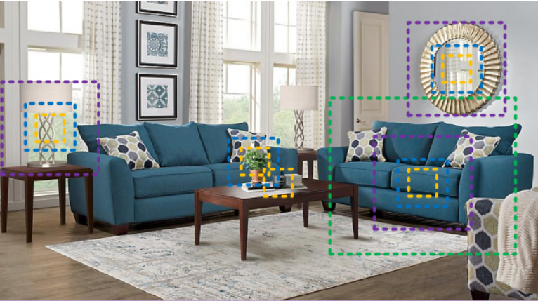
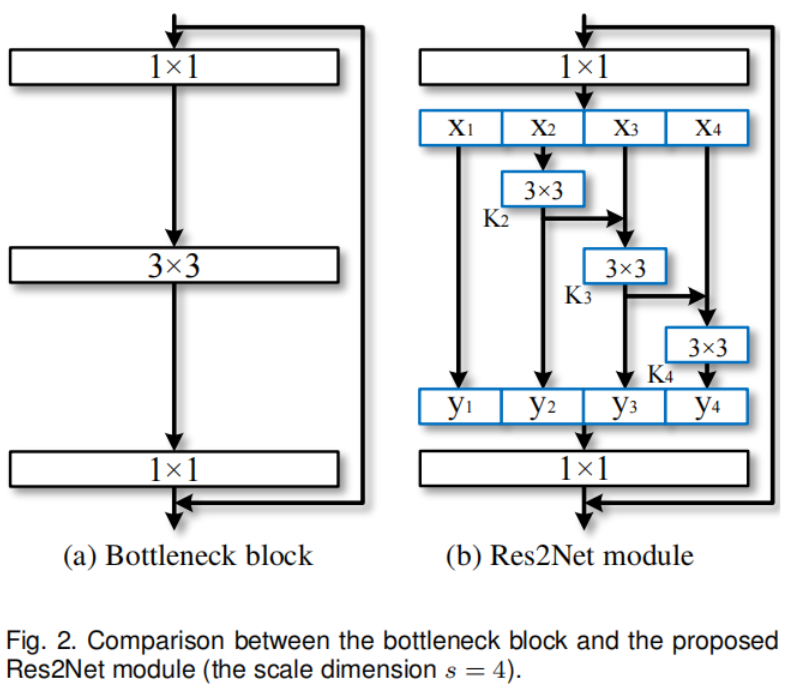
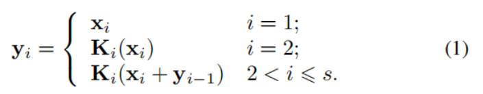
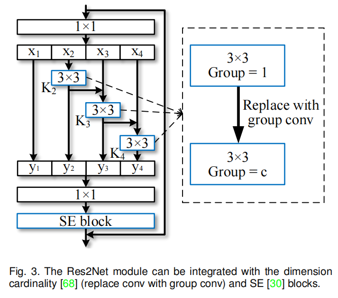

---

layout:     post
title:      「论文分享」Res2Net: 一种新的多尺度骨干网络结构
subtitle:   TPAMI 2021
date:       2021-11-22
author:     WJ
header-img: img/post-bg-hacker.png
catalog: true
tags:
    - 论文分享
---

​		本博客是论文《Res2Net: A New Multi-scale Backbone Architecture》的中文翻译。

# 摘要

​       多个尺度的表示特征对于许多视觉任务是非常重要的。骨干卷积神经网络(CNNs)的最新进展不断显示出更强的多尺度表示能力，在广泛的应用中获得一致的性能增益。然而，现有的方法用分层的方式来表示多尺度特征。在本文中，我们提出了一种新的cnn构建块，即Res2Net，它通过在一个残差块内构造分层的像残差一样的连接。Res2Net代表了颗粒级的多尺度特征，并增加了每个网络层的感受野范围。提出的Res2Net块可以插入到最先进的骨干CNN模型，如ResNet, ResNeXt和DLA。我们在所有这些模型上评估了Res2Net块，并在广泛使用的数据集(如CIFAR-100和ImageNet)上证明了与基线模型相比，获得了一致的性能提高。对具有代表性的计算机视觉任务，即目标检测、类别激活映射和显著目标检测，做了进一步消融研究和实验结果，进一步验证了Res2Net相对于最先进的基线方法的优越性。源代码和经过训练的模型可在https://mmcheng.net/res2net/上获得。

# 1、简介

​         在自然场景中，视觉模式以多尺度出现如图1所示。首先，对象可能以不同的形式出现在一个单一的图像，例如，沙发和杯子的大小是不同的大小。第二，一个对象的基本上下文信息可能会占据比物体本身更大的面积。为实例，我们需要依赖大表作为上下文更好辨别放在它上面的黑色小斑点是杯子还是笔夹。第三，在细粒度分类和语义分割等任务中，感知不同尺度的信息对于理解部分和对象至关重要。因此，为视觉认知任务设计良好的图像分类[33]、目标检测[53]、注意预测等多尺度刺激特征至关重要[55],目标跟踪[76]，动作识别[56]，语义分割[6]，显著目标检测[2]，[29]，目标建议[12]，[53]，骨架提取[80]，立体匹配[52]，边缘检测[45]，[69]。

​       毫无疑问，多尺度特征在传统特征设计[1]、[48]和深度学习中都得到了广泛应用[10],[61]。在视觉任务中获取多尺度表征需要特征提取器使用大范围的感受野来描述不同尺度的物体/部件/上下文。卷积神经网络(cnn)通过一堆卷积算子自然地学习粗到细的多尺度特征。cnn固有的多尺度特征提取能力为解决众多视觉任务提供了有效的表征。如何设计一个更高效的网络架构是进一步提高cnn性能的关键。

图1所示。多尺度表示对于各种视觉任务，如感知目标对象的边界、区域和语义类别，是必不可少的。即使是最简单的识别任务，不同的尺度感知信息对于理解部件、物体(例如，沙发、桌子和杯子)以及它们周围的环境(例如，“在桌子上”的环境有助于识别黑色斑点)是必不可少的。

​       在过去的几年里，几个骨干网络，如[10]，[15]，[27]，[30]，[31]，[33]，[57]，[61]，[68]，[72]，在许多视觉任务中取得了显著进展，性能达到了先进水平。早期的架构，如AlexNet[33]和VGGNet[57]堆叠卷积算子，使多尺度特征的数据驱动学习成为可能。随后，通过使用不同内核大小的卷积(例如，InceptionNets [60]， [61]，[62])、残差模块(如ResNet[27]2016.《Deep residual learning for image recognition》)、shortcut连接(如DenseNet[31]2017《Densely connected convolutional networks》)、分层聚合(例如,DLA[72]2018.《Deep layer aggregation》)。骨干CNN体系结构的发展表明了一种更有效和高效的多尺度表示的趋势。

​          在这项工作中，我们提出了一种简单而有效的多尺度处理方法。不同于现有的增强CNN的分层多尺度表示强度的方法我们在更细粒度的水平上改进了cnn的多尺度表示能力。不同于一些并行工作[5]，[9]，[11]，通过利用不同分辨率的特征提高多尺度能力，我们所提出的多尺度是指在更细粒度水平上的多个可用感受野。为了实现这一目标，我们将n个通道的3×3过卷积核替换为一组更小的卷积核，每个卷积核组都有w个通道(without loss of generality，我们使用n = s × w)。如图2所示，这些较小的卷积核组以一种分层的残差风格连接，以增加输出特征所代表的尺度数量。具体地说，我们将输入特征图分成几组。一组卷积核首先从一组输入特征映射中提取特征。然后，前一组的输出特征与另一组输入特征映射一起被发送到下一组卷积核。这个过程重复几次，直到所有的输入特征图都被处理完。最后，将所有组的特征映射连接起来，发送给另一组1 × 1的卷积核，共同融合信息。随着输入特征转换为输出特征的任何可能路径，当它通过3 × 3卷积核时，相同的感受野增加，由于组合效应得到许多相同的特征尺度。

​         Res2Net策略公开了一个新的维度，即规模scale(Res2Net块中的特征组的数量)，作为现有的维度：深度[57]、宽度，基[68]之外的一个基本因素。我们在第4.4节中指出，增加scale比增加其他维度更有效。

​       注意，提出的方法在更细粒度的级别上利用多尺度的潜力，这与利用分层操作的现有方法是正交的。因此，所提出的构建块，即Res2Net模块，可以很容易地插入到许多现有的CNN架构中。因此，所提出的构建块，即Res2Net模块，可以很容易地插入到许多现有的CNN架构中。大量的实验结果表明，Res2Net模块可以进一步改进最先进的cnn的性能，如ResNet [27]2016.《Deep residual learning for image recognition》，ResNeXt [68]2017.《Aggregated residual  transformations for deep neural networks》， DLA[72]2018.《Deep layer aggregation》。

（1. 卷积算子和卷积核可以互换使用。2. 宽度是指层中通道的数量，如[74]所示。）

# 2、相关工作

## 2.1 主干网络

​          近年来出现了无数的骨干网[15]，[27]，[31]，[33]，[57]，[61]，[68]，[72]，在各种视觉任务中达到最先进的表现，具有更强的多尺度表征。根据设计，cnn具有基本的多尺度特征表示能力，因为输入信息遵循细到粗的方式。AlexNet[33]2012《Imagenet classifification with deep convolutional neural networks》按顺序堆叠过滤器，与传统的视觉识别方法相比获得了显著的性能增益。然而，由于网络深度和卷积核核大小的限制，AlexNet只有一个相对较小的感受野。VGGNet[57]2014.《Very deep convolutional networks for large-scale image recognition》增加了网络深度，使用了更小的内核大小的过滤器。更深层次的结构可以扩展感受野，这有助于从更大的尺度 提取特征。通过叠加更多的层来扩大感受野比使用大的核更有效。因此,VGGNet提供了比AlexNet更强的多尺度表示模型，且参数更少。然而，AlexNet和VGGNet都是直接堆叠卷积核的，这意味着每个特征层都有一个相对固定的感受野。

​        Network in Network(NIN)[38]将多层感知器作为微网络插入到大网络中，以增强模型对于感受野内局部块的鉴别力。NIN中引入的1 × 1卷积是一种常用的特征融合模块。GoogLeNet[61]利用不同核大小的并行卷积核增强多尺度表示能力。然而，由于参数效率有限，这种能力往往受到计算约束的限制。Inception Nets[60]，[62]在GoogLeNet的并行路径的每个路径上堆叠更多的卷积核，以进一步扩展感受野。另一方面ResNet[27]引入了神经网络的短连接，从而在获得更深层网络结构的同时，缓解了梯度消失问题。在特征提取过程中，短连接允许不同的卷积算子组合，导致大量的等价特征尺度。类似地，DenseNet[31]中的紧密连接层使网络能够处理范围非常广的对象。DPN[10]将ResNet和DenseNet结合起来，实现了ResNet的特征重用能力和DenseNet的特征探索能力。最近提出的DLA[72]方法在树结构中结合了层。层次树结构使网络具有更强的分层多尺度表示能力。

## 2.2视觉任务的多尺度表示

​          cnn的多尺度特征表示在目标检测[53]、人脸分析[4]、[51]、边缘检测[45]、语义分割[6]、显著目标检测[42][78]、骨架检测[80]等视觉任务中具有重要意义，提高了这些领域的模型性能。

### 2.2.1对象检测。Object detection.

​          有效的CNN模型需要定位场景中不同比例的物体。早期的R-CNN[22]等工作主要依赖于骨干网络，即VGGNet[57]，提取多个尺度的特征。He等人提出了SPP-Net方法[26]，利用骨干网络后的空间金字塔池化增强多尺度能力。Faster R-CNN方法[53]进一步提出了区域建议网络来生成不同尺度的bounding boxes。FPN[39]方法在Faster RCNN的基础上，引入特征金字塔，从单幅图像中提取不同尺度的特征。SSD方法[44]利用不同阶段的特征图对不同尺度的视觉信息进行处理。

### 2.2.2语义分割。Semantic segmentation.

​         提取目标对象的重要的上下文信息 需要利用CNN模型处理不同尺度的特征，实现有效的语义分割。Long等人[47]提出了一种最早的方法，使全卷积网络(FCN)用于语义分割任务的多尺度表示。在DeepLab中，Chen等人[6]，[7]引入了级联atrous卷积模块，在保持空间分辨率的同时进一步扩展感受野。最近，通过PSPNet中的金字塔池方案，从基于区域的特征聚合全局上下文信息[77]。

### 2.2.3显著目标检测。Salient object detection

​       精确定位图像中显著目标区域需要理解大尺度背景信息来确定目标显著性，也需要理解小尺度特征来精确定位目标边界[79]。早期的方法[3]利用全局对比度[13]或多尺度区域特征的手工表示[64]。Li等人[34]提出了一种最早的方法，使多尺度深度特征用于显著目标检测。随后，提出了多上下文深度学习[81]和多层次卷积特征[75]来改进显著目标检测。最近，侯等人。[29]在各阶段之间引入密集的短连接，在每一层提供丰富的多尺度特征图，用于显著的目标检测。

## 2.3并行工作

​       目前，有一些并行的工作，旨在利用多尺度特征[5]，[9],[11],[59]。Big-Little Net[5]是由不同计算复杂度的分支组成的多分支网络。Octave Conv[9]将标准卷积分解为两种分辨率，以处理不同频率的特征。MSNet[11]利用高分辨率网络学习高频残差，利用低分辨率网络学习的上采样低分辨率特征。除了当前工作中的低分辨率表示，HRNet [58]，[59]在网络中引入高分辨率表示，并反复进行多尺度融合以增强高分辨率表示。在[5]， [9]，[11]，[58]，[59]中的常见操作，是它们都使用池化或上采样将feature map的大小调整为原始规模的2的n次方倍，以节省计算预算，同时保持甚至提高性能。而在Res2Net块中，单个残块模块内的分层残差类连接使接受域在更细粒度的水平上的变化能够捕获细节和全局特征。实验结果表明，Res2Net模块可以与这些新型网络设计相结合，进一步提高性能。而在Res2Net块中，单个残块模块内的分层像残差一样的连接使感受野在更细粒度的水平上的变化能够捕获细节和全局特征。实验结果表明，Res2Net模块可以与这些新型网络设计相结合，进一步提高性能。

# 3 RES2NET

## 3.1 Res2Net Module

​           图2(a)所示的瓶颈结构是许多现代骨干CNNs架构中的基本构建块，如ResNet [27]2016.《Deep residual learning for image recognition》，ResNeXt [68]2017.《Aggregated residual  transformations for deep neural networks》， DLA[72]2018.《Deep layer aggregation》。与瓶颈块中使用一组3 × 3卷积核提取特征不同，我们寻求具有更强多尺度特征提取能力的替代架构，同时保持相似的计算负载。具体来说，我们替换了一组3 × 3个卷积核和更小的卷积核组，同时以分层的残差风格连接不同的卷积核组。由于我们提出的神经网络模块涉及单个残差块中的**res**idual-like连接，我们将其命名为Res2Net。

​          图2显示了瓶颈块与提出的Res2Net模块的区别。在1×1卷积后，我们均匀地将特征图划分为s个特征图子集，用xi表示，其中i∈{1,2，…,s}。与输入特征图相比，每个特征子集xi的空间大小相同，但通道数为1/s。除x1外，每个xi都有对应的3 × 3卷积，用Ki()表示。我们用yi表示Ki()的输出。特征子集xi加上Ki−1()的输出，然后输入到Ki()。减少参数的同时增加s，我们省略了x1的3 × 3卷积。因此，“yi”可以写成:

​          注意，每个3 × 3卷积算子Ki()都可能从所有特征分割中接收特征信息{xj, j≤i}。每次一个特征分割xj经过一个3 × 3卷积算子时，输出结果的感受野可能比xj大。由于组合爆炸效应，Res2Net模块的输出包含不同数量和不同感受野大小/规模的不同组合。

​          在Res2Net模块中，分割以多尺度的方式进行处理，这有利于提取全局和局部信息。为了更好地融合不同尺度的信息，我们将所有的分割拼接起来，并将它们通过1 × 1卷积。拆分和连接策略可以强制卷积更有效地处理特征。为了减少参数的数量，我们省略了第一次拆分的卷积，这也可以看作是特征重用的一种形式。

​          在这项工作中，我们使用s作为尺度尺寸的控制参数。更大的s可能允许具有更丰富的感受野大小的特征被学习，而连接引入的计算/内存开销可以忽略不计。

## 3.2与现代模块的集成

​       近年来，人们提出了许多神经网络模块，包括Xie等人[68]提出的基数维数，以及Hu等人提出的挤压和激励(SE)块。本文提出的Res2Net模块引入与这些改进正交的比例维度。如图3所示，我们可以很容易地将基数维度[68]和SE块[30]2018.《Squeeze-and-excitation networks》与提出的Res2Net模块整合在一起。

图3所示。Res2Net模块可以与维度基数[68](将conv替换为组conv)和SE[30]块集成。

### 3.2.1维度基数（Dimension cardinality）

​         维度基数表示卷积核内的组数[68]2017.《Aggregated residual  transformations for deep neural networks》。该维度将卷积核从单分支变为多分支，提高了CNN模型的表示能力。在我们的设计中，我们可以将3 × 3卷积替换为3 × 3组卷积，其中c表示组数。规模维数和基数之间的实验比较在第4.2节和第4.4节。

### 3.2.2 SE块 （SE block）.

​       SE块通过显式建模通道之间的相互依赖关系[30]2018.《Squeeze-and-excitation networks》，自适应地重新校准通道特征响应。与[30]类似，我们在Res2Net模块的残差连接之前添加SE块。我们的Res2Net模块可以受益于SE块的合并，我们已经在第4.2节和第4.3节中进行了实验演示。

## 3.3 Integrated Models

​       自提出Res2Net模块没有特定需求的整体网络结构和多尺度表示的能力Res2Net模块正交于cnn的layer-wise功能聚合模型,我们提出Res2Net模块可以很容易地集成到state-ofthe-art模型,如ResNet [27],ResNeXt [68]， DLA[72]和Big-Little Net[5]2019.《Big-Little Net: An Effificient Multi-Scale Feature Representation for Visual and Speech Recognition》。对应的模型分别为Res2Net、Res2NeXt、Res2Net- dla和bLRes2Net-50。

​       提出的规模scale维度正交于基数[68]维度和先前工作的宽度[27]维度。因此，在设置规模scale之后，我们调整基数和宽度的值，以保持与对应的模型的整体复杂性相似。我们不关注缩小模型尺寸在这项工作中，因为它需要更细致的设计，如深度可分离卷积[49]，模型剪枝[23]和模型压缩[14]。

​         在ImageNet[54]数据集上的实验，我们主要使用ResNet-50[27]、ResNeXt-50[68]、DLA-60[72]和bLResNet-50[5]作为我们的基线模型。提出模型的复杂度与基线模型大致相当，对于50层网络，224 × 224像素的图像，其参数个数约为25M，FLOPS数约为4.2G。对于在CIFAR[32]数据集上的实验，我们使用ResNeXt-29, 8c×64w[68]作为我们的基线模型。关于提出的模型复杂性的经验评价和讨论将在第4.4节中介绍。