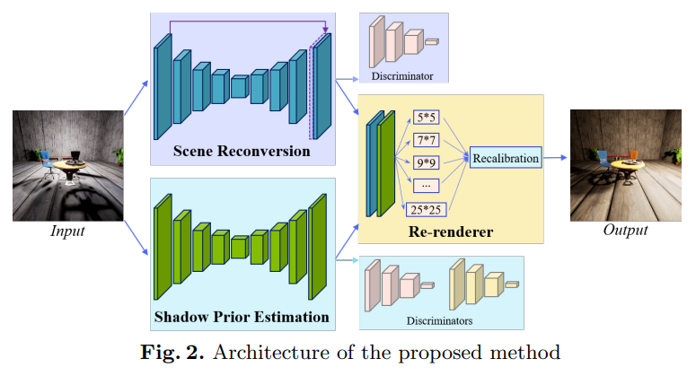
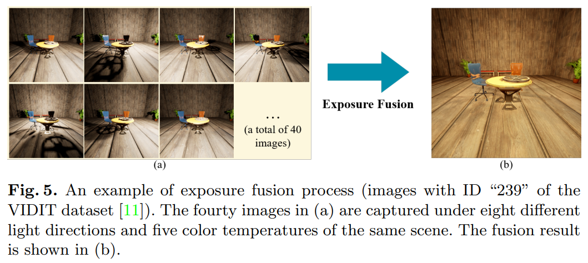

---

layout:     post
title:      「论文分享」用于图像光源操作的深度重光照网络
subtitle:   ECCV 2020
date:       2022-03-18
author:     WJ
header-img: img/the-first.png
catalog: True
tags: [论文分享]
   
---

​		本文介绍ECCV Workshop 2020年的《Deep Relighting Networks for Image Light Source Manipulation》，作者主要是来自香港理工大学，相关代码已经发布在 https://github.com/WangLiwen1994/DeepRelight。该文章的方法参加了“AIM Image Relighting Challenge - Track 1: any to one”，任务目标是在给定任何类型照明下的图像，估计在给出特定光源（色温为 4500k，光方向为东）下的重照明图像。 

# 摘要

​			操纵给定图像的光源是一项有趣的任务，在各种应用中都很有用，包括摄影和电影摄影。现有的方法通常需要额外的信息，如场景的几何结构，这可能不适用于大多数图像**。在本文中，我们用公式表示单图像重照明任务，并提出了一种新的深度重照明网络（DRN）**，该网络由三部分组成：

​			1）场景重建，其目的是通过深度自动编码网络显示主要场景结构。

​			2）阴影先验估计，通过对抗性学习，从新的灯光方向预先确定灯光效果。

​			3）重新渲染，将主要结构与重建的阴影视图结合起来，形成目标光源下所需的估计图像。

​			实验结果表明，该方法在定性和定量上都优于其他方法。具体而言，本文提出的DRN在2020年ECCV大会的“AIM2020-任何对一重新照明挑战”中实现了最佳峰值信噪比（PSNR）。

# 方法

​		该文提出的深度重照明网络（DRN）如下图所示：

​		DRN由三部分组成：场景重建、阴影先验估计和重新渲染器。 首先，输入图像在场景重建网络中处理以去除照明的影响，这从输入图像中提取固有结构。 同时，另一个分支侧重于光照效果的变化，根据目标光源重新投射阴影。 接下来，重新渲染器部分感知光照效果并在结构信息的支持下重新绘制图像。 场景重建和阴影先验估计网络都具有类似的深度自动编码器结构，这是一种Pix2Pix网络增强的变体。

## 1、重光照估计（Assumption of Relighting）

​		该文章讨论Any-To-One的单图像重光照任务。假设输入图片为$\mathbf{X} \in \mathbb{R}^{\mathrm{H} \times \mathrm{W} \times 3}$，其可能是处于任意光源$\Phi$下的照明效果，该任务旨在给定目标光源$\Psi$重新渲染出新的图像。根据 2004年的《Retinex processing for automatic image enhancement》和2018年的《Deep retinex decomposition for lowlight enhancement》的Retinex 理论 ， 输入图像可以写成：
$$
\mathbf{X}=L_{\Phi}(\mathbf{S})
$$
​		其中$\mathbf{S}$是在不同光照条件下不可改变的固有场景信息， $L_{\Phi}()$是定义的一个照明操作 ，它用以提供在光源$\Phi$下的全局照明和场景 $\mathbf{S}$产生的阴影效果。

​		图像重光照的公式表达如下：
$$
\mathbf{Y}=L_{\Psi}\left(L_{\Phi}^{-1}(\mathbf{X})\right)
$$
​		其整体可以分为以下两步操作：

​		（1）场景重建操作：$L_{\Phi}^{-1}()$。该步是从输入图像$\mathbf{X}$中恢复结构信息$\mathbf{S}$，目的是去除原有的光照效果，该步骤的关键是去除阴影

​		（2）重光照操作：$L_{\Psi}()$。该步是用目标光源$\Psi$重新进行照明操作$L_{\Psi}()$，从而得到新的图像$\mathbf{Y}$，该步骤的关键是增加阴影。

​			由于单图像重光照没有额外的几何信息输入，所以重光照操作的难度更大。该文称其所提出的方法不是直接找到某个重光照操作$L_{\Psi}()$，而是寻找一个将光照效果（主要是阴影）从输入图像迁移到目标图像的转移操作$L_{(\Phi \rightarrow \Psi)}(\mathbf{X})$，这显著降低了重新绘制阴影的难度，最后使用一个重渲染过程$P\left( ·\right)$来结合场景信息和光照效果。整个过程可以表示为：
$$
\hat{\mathbf{Y}}=P\left(L_{\Phi}^{-1}(\mathbf{X}), L_{(\Phi \rightarrow \Psi)}(\mathbf{X})\right)
$$

## 2、场景重建（Scene Reconversion）

​		场景重建的目的是从图像$\mathbf{X}$中提取固有的结构信息$\mathbf{S}$，从而去除光照效果。 该网络采用带有跳跃连接的自动编码器结构 [22] 来提取浅层特征，具备一个与 Pix2Pix 方法（ 2017年《Image-to-image translation with conditional adversarial networks》 ）类似的自动编码器结构，其中 9 个残差块（2016年的《Deep residual learning for image recognition》）图中的“ResBlocks”）用于消除光照效果。

​		

​		【下采样】首先， 输入图像$Input$被进行4次下采样操作（图中的“DBP”）来找到场景的判别特征（编码）。 每次下采样过程后，通道都会加倍，以尽可能多地保留信息。 这些特征具有大的感受野，其中包含许多有益于光照估计和操纵的全局信息。

​		【上采样】然后，经过上采样的特征图经过4次上采样操作（图中的“UBP”）映射回原始图片大小，然后通过跳跃连接的浅层特征丰富它。 特征图与由卷积层作用的特征选择过程进一步聚合，将通道从 64 减少到 32（“Conv.”（灰色矩形））， 最后输入重新渲染器流程。

### （1）反向投影块（**Back-Projection Block**）

​		该文没有通过常规的池化或步幅卷积过程来对特征进行下采样或者上采样，而是采用反向投影块，通过残差来弥补丢失的信息。

​	

​		 如上图所示，下采样反投影 (DBP) 和上采样反投影 (UBP) 块由在输入空间和潜在空间之间映射信息的编码和解码操作组成。 以 DBP 块为例，它首先将输入（X）映射到潜在的空间 (Z) 通过编码过程（E1，由步长卷积层作用，过滤器大小为 3 × 3，步长为 2，填充为 1）。 然后，解码器（D2，由滤波器大小为 4 × 4，步长为 2，填充为 1 的反卷积层）将其映射回输入空间（ ˆX）以计算差异（残差，RX = X − ˆX  ）。 残差被编码（E2，由滤波器大小为 3×3，步幅为 2，填充为 1 的步幅卷积层作用）到潜在空间 RZ 以修复潜在代码（ˆZ = Z+RZ）。 

​		数学上，DBP 和 UBP可以写成：

​		

​	

### （2）半监督重建（**Semi-supervised reconversion**）

​		**完全监督学习和半监督学习的区别？**完全监督学习使用明确定义的标签来训练网络，半监督学习无法得到明确定义的真实标签，只能使用接近真实的参考标签来训练网络。		

​		从单张图像中提取的场景信息很难定义，所以我们无法通过明确定义的真实图像来完全监督网络，只能通过人工观察到的图像来半监督网络。该文方法使用的场景重建网络使用单张图片中相应的无阴影图像作为半监督的真实图片来训练网络，这种无阴影图像可能包含来自固有场景结构的冗余信息。

​		该文采用曝光融合方法来获取场景的无阴影图片，该方法曾被广泛用于改善在不均匀光照条件下捕获的图像的动态范围。曝光融合方法将多张曝光不同的图像合并为一个可见度更好的图像。 （《Recovering high dynamic range radiance maps from photographs》、《Exposure fusion: A simple and practical alternative to high dynamic range photography》）

​		该文采用的虚拟图像数据集 (VIDIT)  （《Vidit: Virtual image dataset for illumination transfer》）中 包含来自 390 个场景的图像，每个场景都使用八个不同的光方向和五个色温捕获 40 次，不同的光线方向会在不同的位置投射阴影，这使得通过选择非阴影像素来构建无阴影图像成为可能。

​		 该文采用和《Exposure fusion: A simple and practical alternative to high dynamic range photography》相同的策略来构建由 OpenCV 包 （《 The OpenCV Library. Dr. Dobb’s Journal of Software Tools》）实现的无阴影图像：

（1）太暗（曝光不足）或太亮（曝光过度）的像素被赋予较小的权重。 

（2）具有高饱和度（RGB 通道的标准偏差）的像素通常处于良好的光照下，被赋予较大的权重。  

（3）边缘和纹理通常包含更多信息，被认为更重要。 

​		下图是一个曝光融合的例子。图中的图像是在不同的光方向和色温下捕获的。 很明显，这些图像包含由点光源引起的阴影。 使用曝光融合方法后，得到一张场景结构明显的无阴影图像。

​	

### （3）对抗学习（**Adversarial Learning**）

​		为了训练场景重建网络，通过卷积层（图中“Conv.”）形成无阴影图像。它将潜在结构传输回图像空间。 但是，阴影会导致输入图像中出现空洞。 为了填补具有良好感知一致性的漏洞，该文附加了一个鉴别器来辅助场景重建网络的训练，该文采用与 《Image-to-image translation with conditional adversarial networks》相同的鉴别器结构，该结构堆叠四个跨度卷积层，分层提取全局表示。 在训练过程中，判别器被分配来区分（场景重建网络的）估计与真实无阴影图像。 一开始，估计缺乏结构信息。 鉴别器注意到弱点并基于它进行分类。同时，场景重建网络被分配来欺骗鉴别器，预测与目标无阴影图像相似的结构相关性的估计图像。 在数学上，对抗性学习是：
$$
\mathcal{L}_{c G A N}(G, D)=\mathbb{E}_{\left(\mathbf{X}, \mathbf{Y}_{s f}\right)}\left[\log D\left(\mathbf{X}, \mathbf{Y}_{s f}\right)\right]+\mathbb{E}_{\mathbf{X}}[\log (1-D(\mathbf{X}, G(\mathbf{X})))]
$$

​		其中生成器G 旨在最小化$\mathcal{L}_{c G A N}(G, D)$ 的损失，即 G* = arg minG maxD LcGAN (G, D)。 鉴别器 D 试图最大化损失$\mathcal{L}_{c G A N}(G, D)$ 。 术语 $c G A N$ 表示鉴别器将输入图像 X 作为先验信息，是一种条件 GAN 结构。 考虑到估计的场景结构应该接近真实的无阴影目标 $\mathbf{Y}_{s f}$，使用传统的 L1 范数损失来衡量估计的每像素误差。 场景重建网络的目标定义为：
$$
G^{*}=\lambda \mathbb{E}_{\left(\mathbf{X}, \mathbf{Y}_{s f}\right)}\left[\left\|\mathbf{Y}_{s f}-G(\mathbf{X})\right\|\right]+\arg \min _{G} \max _{D} \mathcal{L}_{c G A N}(G, D)
$$
其中术语$\lambda$ 平衡了 L1 范数和对抗性损失。

## 3、阴影先验估计（Shadow Prior Estimation）

​		不同的光源会产生不同的光效，例如产生不同的阴影和色温。 为了产生目标光源的光效，该文使用了与场景重建类似的网络结构来设计一个阴影先验估计网络，其架构如下图所示。

​	

​		该网络与场景重建网络的不同点主要有三个：

1）该网络丢弃了跳跃连接，因为该网络希望更加关注全局光效应，跳跃连接直接将局部特征带到输出中，这使网络不容易学习全局变化。

2）该网络使用经过修改的阴影区域鉴别器，以专注于阴影区域的识别。该鉴别器采用与（ 2017年《Image-to-image translation with conditional adversarial networks》 ）相同的结构，堆叠四个步幅卷积层，逐渐提取全局特征表示。 

​		为了关注阴影区域，首先校正估计以通过 z = min(α; x) 关注低强度区域（暗，通常是阴影），其中符号 x 表示估计的像素强度。符号z表示将输入到鉴别器的修正值。术语 α 是阴影敏感度的预定义阈值（根据经验，它设置为 0.059 = 15/255）

  3）在数学上，阴影先验估计网络的目标可以描述如下：

$$
\begin{array}{r}
G^{*}=\lambda \mathbb{E}_{\mathbf{X}, \mathbf{Y}}[\|\mathbf{Y}-G(\mathbf{X})\|]+\arg \min _{G} \max _{D} \mathcal{L}_{c G A N}(G, D) \\
+\arg \min _{G} \max _{D_{s h a d}} \mathcal{L}_{c G A N}\left(G, D_{s h a d}\right)
\end{array}
$$
​		其中 ground-truth目标是目标光源下的图像。 Dshad 表示阴影区域鉴别器（细节将在下面说明）， Y 表示目标光源下的图像。

## 4、重渲染模块

 		经过场景重建网络和阴影先验估计网络的处理后，估计的场景结构和光照效果将融合在一起以产生重光照后的输出，如下图所示。

​	

​		重新渲染器由三部分组成：多尺度感知、通道重新校准和绘制过程。 

**（1）多尺度感知块**。重新渲染器使用一种新的多尺度感知块，不同尺度的感知块有利于获取场景的全局和局部信息，这是十分必要的，全局信息有利于阴影和光照的一致性，而局部信息增强了光照效果的纹理细节。该文使用的多尺度感知块具有不同感知大小的过滤器（例如，过滤器大小为 3 × 3、5 × 5，...）。

（2）**通道重新校准。**该过程用于学习不同通道的权重，从而为以下绘制过程选择关键特征。经过多尺度感知块处理后，具有不同空间感知的特征被合并成一个单一的特征图，其中每个通道存储一种类型的空间模式。 但是，不同的模式对于重新渲染过程可能具有不同的重要性。 

（3）**绘制块。**绘制块是一个卷积层（滤波器大小为 7 × 7，填充为 3，步幅为 1 和 tanh 激活函数），用于将预测特征从特征空间绘制到图像空间。

​		**损失函数**：重渲染器的损失函数由每像素重建误差和感知误差组成。 重建误差是通过广泛使用的 L1 范数损失来衡量的。感知相似度（2016年的《Perceptual losses for real-time style transfer and super-resolution》）基于从 VGG-19 网络中提取的特征计算。 VGG-19网络使用 ImageNet 数据集进行了预训练，用于图像分类。 提取的特征对视觉比较具有判别力，因此可以用来衡量感知相似度。 损失函数定义为：
$$
\mathcal{L}(\mathbf{Y}, \hat{\mathbf{Y}})=\|\mathbf{Y}-\hat{\mathbf{Y}}\|+\lambda\|f \operatorname{eat}(\mathbf{Y})-\operatorname{feat}(\hat{\mathbf{Y}})\|
$$
​		其中平衡系统设置为0.01。

# 实验

## 1、数据集

​        Virtual Image Dataset for Illumination Transfer (VIDIT) 数据集包含 390 个不同场景内容（例如金属、木材等）的虚拟场景，其中有 300 个用于训练的场景、45 个用于验证的场景和 45 个用于单独测试场景 。 所有场景由强大的游戏引擎（虚幻引擎 4 ）渲染以获得高分辨率图像。  VIDIT 数据集的目标是照明操作。 每个场景用八个光方向和五个色温进行渲染，从而产生分辨率为 1024*1024 的 40 张图像。该文使用 300 个训练场景中的所有可能对来训练网络，并使用提供的验证数据集（45 个场景）进行评估。

## 2、训练策略

​		受 GPU 内存和计算能力的限制，该文对三个子网络（场景重建、阴影先验估计和重新渲染器）进行分别训练。 首先，作者通过设计的损失函数使用成对的输入图像和无阴影目标图像来训练场景重建网络。 接着，使用成对的输入图像和目标图像来训练阴影先验估计网络。 最后，在固定场景重建网络和阴影先验估计网络并移除了它们的最后一个卷积层和鉴别器（图 5 中的绿色圆圈和图 6 中的粉红色圆圈）的情况下，使用设计的损失函数训练重新渲染器网络。

## 3、训练设置

​		所有训练图像的大小从 `1024*1024` 调整为 `512*512`，并且 mini-batch 大小设置为 6。 使用Adam优化方法，动量为0.5，学习率为0.0001。 网络随机初始化为[33]。 正如前文提到的，场景重建网络和阴影先验估计网络首先独立训练，其中每个网络训练 20 个epoch。 然后，将两个网络固定，重新渲染器网络也训练了 20 个 epoch。 所有实验都是通过 PyTorch （2019年的《Pytorch: An imperative style, high-performance deep learning library》）在带有两个 NVIDIA GTX2080Ti GPU 的 PC 上进行的。

## 4、评价方法

​		本文使用峰值信噪比（PSNR）和结构相似性（SSIM）（2004年的《Image quality assessment: from error visibility to structural similarity》）来衡量预测图像与真实图像之间的相似性，其中较大的值意味着更好的性能。 为了衡量感知质量，本文使用了学习感知图像块相似度（LPIPS）（2020年的《Bisenet v2: Bilateral network with guided aggregation for real-time semantic segmentation》），其中较小的值意味着更多的感知相似度。

## 5、消融实验

​		由于基于深度学习的重光照是一项新话题，因此可用于比较的方法很少。重光照问题可以看作是将光源转换为目标设置的图像到图像转换任务，因此，该文章采用了Pix2Pix[14]  作为基线模型。 Pix2pix 是一种通过对抗策略训练的有条件 GAN 结构，在图像到图像的转换任务中取得了巨大的成功，如背景去除、姿势转移等。Pix2Pix 方法基于自动编码器结构，其中输入图像首先被下采样四次（比例缩小到 1/16），然后由九个残差块处理。 最后，一组反卷积层用于将图像上采样回原始大小并形成估计。 

​	

​		表 1 给出了不同结构之间的比较，其中 ShadAdv 和 BPAE 是 Pxi2Pix 网络的两种变体。 基线方法 (Pix2Pix) 在 PSNR 中达到 16.28 dB，在 SSIM 中达到 0.553，在 LPIPS 中达到 0.482。

#### （A）Pix2Pix和ShadAdv的比较

​		ShadAdv和 Pix2Pix的区别就是ShadAdv添加了提出的阴影区域鉴别器来增强基线 Pix2Pix。 表中PSNR 提高了 0.84(= 17.12 − 16.28) dB，感知质量在 LPIPS 方面提高了 0.042 (= 0.482 − 0.440)。可以得出结论，与原始的 Pix2Pix 方法相比，“ShadAdv”更加注重阴影区域的外观。 换句话说，阴影鉴别器可以为重新投射目标光源的阴影提供更好的指导。

#### （B）反投影模块的效果

​		“Pix2Pix”和“ShadAdv”方法基于自动编码器结构。 正如我们所提到的，它通过堆叠的卷积和反卷积层对图像进行下采样和上采样。  “BPAE”方法是自动编码器的增强版本，其中下采样和上采样过程由 DBP 和 UBP 块完成（如图 4 所示）。  BP 块基于反投影理论，它弥补了下采样和上采样过程中丢失的信息。 与自动编码器结构（在“ShadAdv”中使用）相比，“BPAE”方法提取了更多信息特征，丰富了估计的结构，将 SSIM 从 0.569 增加到 0.573。

#### （C）重光照假设的影响

​		Pix2Pix、ShadAdv和BPAE方法都直接学习输入图像到真实图像的映射，本文所提出的方法DRN则使用了两阶段假设，以最高的 PSNR (17.59 dB) 和 SSIM (0.596) 分数以及可比较的视觉相似性（LPIPS 的 0.440）实现了最佳重建。

​		该文将AnyToOne重照明任务视为两个阶段问题，其中第一阶段找到来自输入图像 X的场景结构 L−1 Φ (X) 和光效 L(Φ→Ψ)(X) 。第二阶段在目标光源下绘制 P(·) 估计 ˆY。   “DRN”是基于我们的重照明假设提出的方法。 

## 6、对比实验

​		除了与Pix2Pix进行对比，该文还与其他代表性方法进行了比较。 该文在 VIDIT训练数据集上用原方法的设置重新训练，并使用 VIDIT 验证数据集进行了比较。

​		 U-Net [22] 是一个流行的 CNN 结构，最初设计用于生物医学图像分割。 它由下采样（编码器）和上采样（解码器）路径组成，形成一个自动编码器结构，其中几个短接将信息从编码器直接传输到解码器部分。	

​		Retinex-Net [35] 旨在启发基于 Retinex 理论的低光图像， 它首先将低光图像分解为反射率和照明元素，然后调整子网络细化照明以照亮输入图像。 

​	

​		接下来的定性对比实验结果：

